# 一、React Server Components

RSC是一种新型态的组件形式，可以专门在服务器上运行，并且可以执行数据可查询、文件读写等操作。与之相对应的就是React Client Components(RCC).

## 特性
1. 减少最终打包体积
2. 避免瀑布式获取数据
3. 渐进式渲染

## 渲染方式

### 客户端渲染——Client Side Rendering

请求html => 加载js、css等资源 => 初次渲染 => 执行js并请求需要的数据 => 渲染出页面

组件存在于客户端，在处理交互或与服务端交互后请求数据后在客户端更新页面

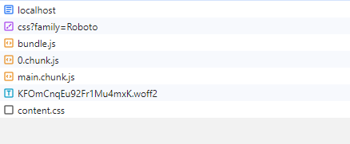

```html
<!DOCTYPE html>
<html>
  <body>
    <div id="root"></div>
    <script src="/static/js/bundle.js"></script>
  </body>
</html>
```
### 静态渲染SSG——Static Site Generation

构建的时直接把结果页面输出为html到磁盘并在服务器启动静态server，实现静态站点生成。

不需要动态生成、页面交互少，如博客、新闻等站点。

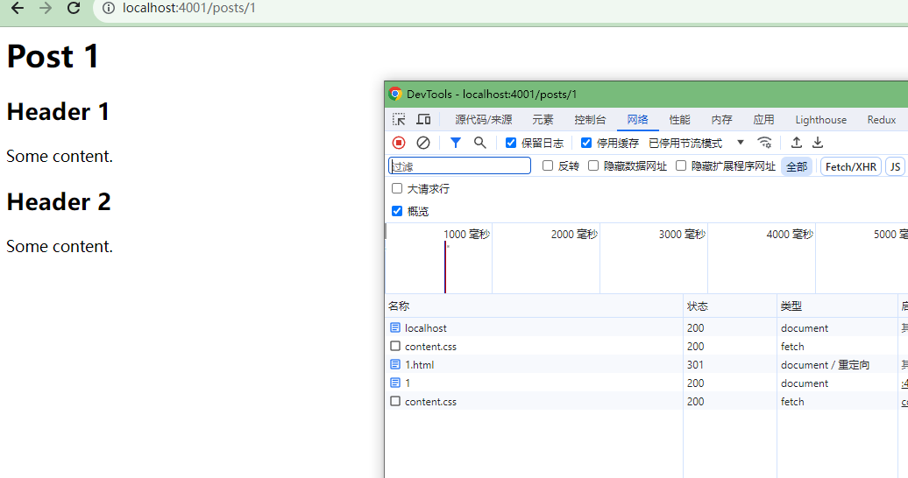

### 服务端渲染SSR——Server Side Rendering

可以理解为组件被分为两部分，服务端可用来初次渲染生成静态页面的组件、后续需要交互和逻辑的客户端组件

1. 每次访问时在服务器端将页面预渲染成一个包含初始状态的 HTML 返回给客户端
2. 客户端会请求页面并加载包含应用逻辑的JS
3. 水合（hydrated）打包好的JS中的逻辑如交互逻辑、更新页面状态进入客户端渲染阶段。

可以加快首次渲染并有利于网站的SEO，但是依旧存在问题
瀑布流：获取数据（服务器）→ 渲染为 HTML（服务器）→ 加载代码（客户端）→ hydrate（客户端）
1. 在首次显示之前，依旧需要先获取所有内容比如首次渲染需要的数据等
2. 在水合之前，依旧需要装载所需要的js
3. 在可以交互之前，需要先给整个html水合装载的所有js

可以通过Suspense来将整个渲染HTML以及水合的过程拆分成不同的部分分开传输或者执行
```javascript
import { lazy } from 'react';

const Comments = lazy(() => import('./Comments.js'));

// ...

<Suspense fallback={<Spinner />}>
  <Comments />
</Suspense>
```
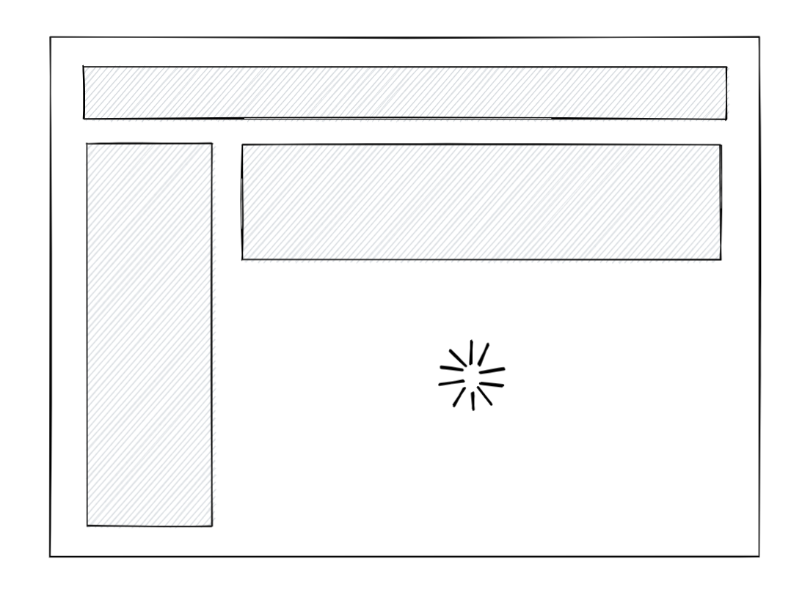
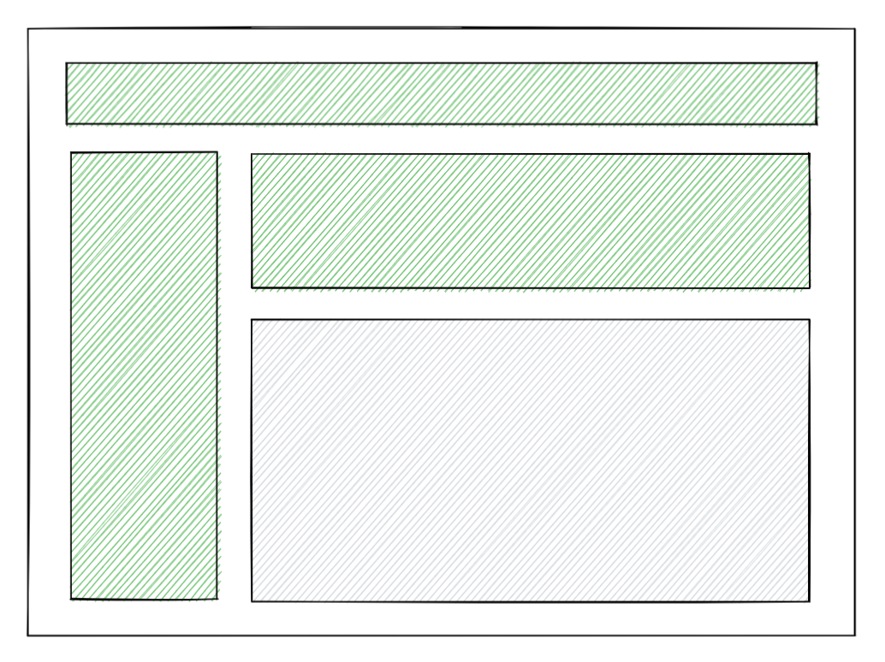

但是模块内部的瀑布流依然存在。


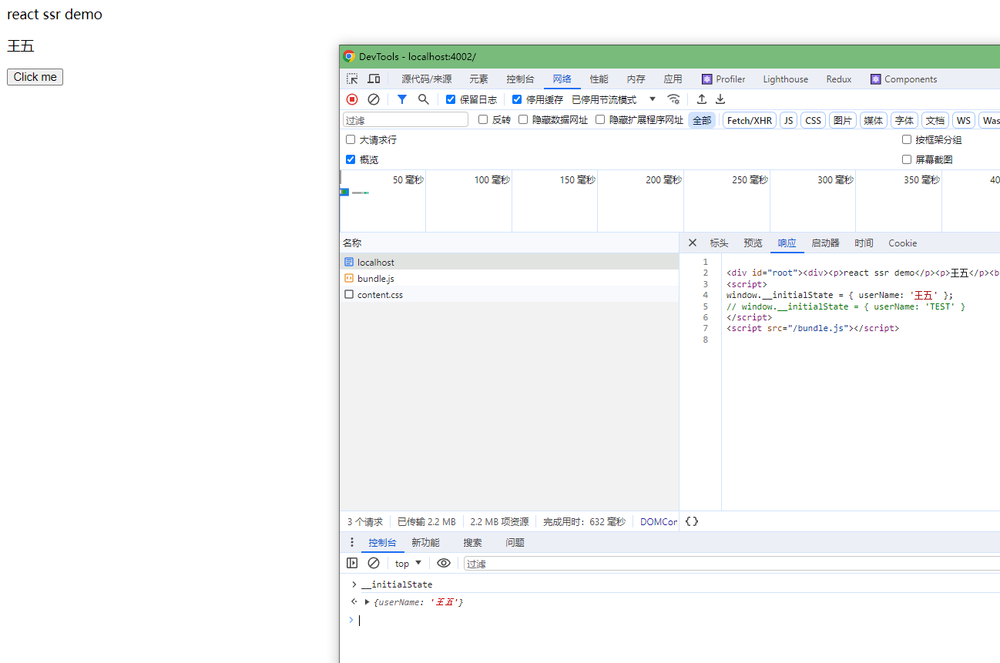

## React Server Components应用场景及其优点

1. 减少打包体积：如果我们在服务器组件内使用任何第三方库，该库将不会包含在客户端的捆绑包中。这将减小 JavaScript 捆绑包的大小
2. 直接访问服务器端存储的数据：如DB、文件等
3. 自动代码分割：服务器组件对导入的客户端组件视为一个分割点


```javascript
'use server'
import OldRenderer from './OldRenderer.js';// client component
import NewRenderer from './NewRenderer.js';// client component

function Render(props) {
  // 只有判断后需要的客户端组件才会被客户端获取并渲染
  if (feature.useNewRenderer) {
    return <NewRenderer {...props} />;
  } else {
    return <OldRenderer {...props} />;
  }
}
```

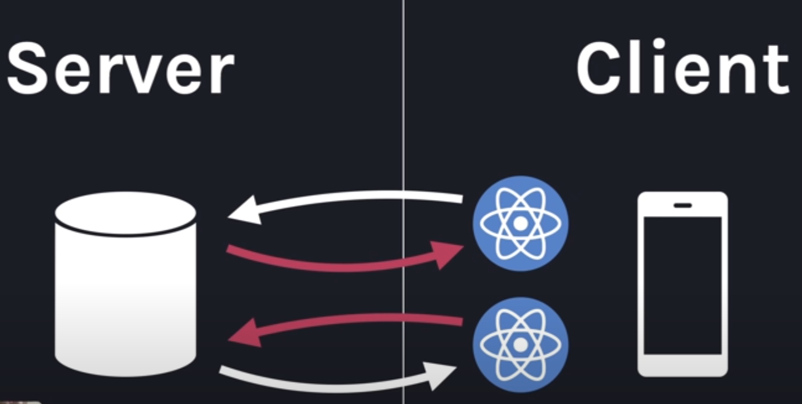

### 工作流程
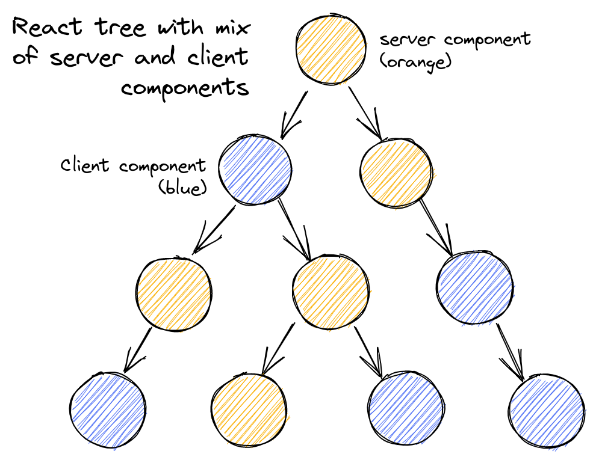
1. 路由根组件总是一个 server component，在获取到渲染请求后首先需要将根组件，基于HTML元素节点和客户端组件占位符，构建可序列化的树形结构
[JSON状态标识](https://github.com/facebook/react/blob/main/packages/react-client/src/ReactFlightClient.js)
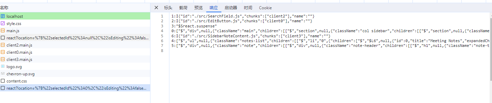
2. 将服务器组件中对客户端组件的引用转换为可序列化的“模块引用”对象
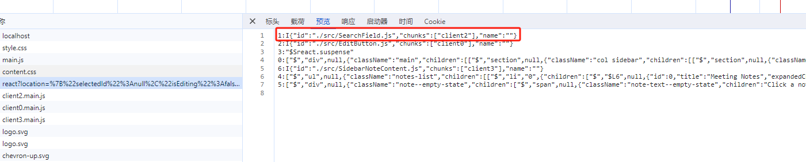
3. 将拿到根组件的的树形结构转化为 React 树，并将客户端组件的模块引用转化为浏览器获取到的真正的客户端组件chunk
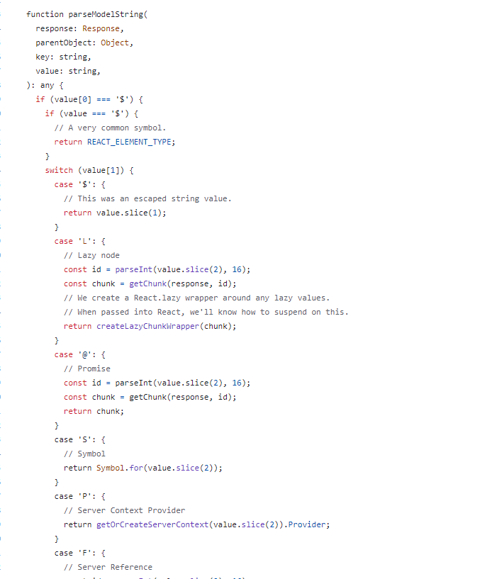
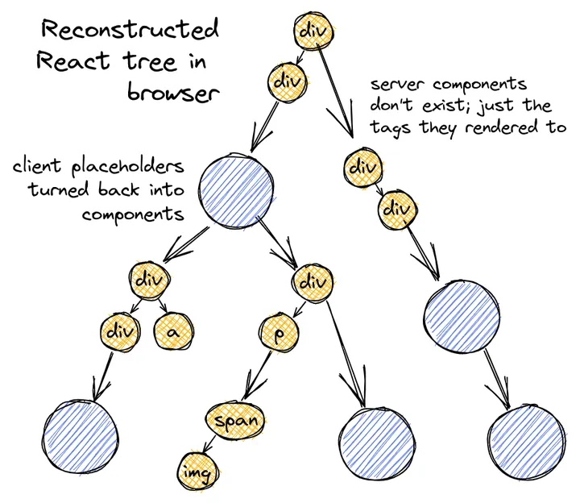
4. 将结合好的这棵树渲染并提交到DOM中
5. 触发服务器组件更新，重新构造RSC请求获取新的序列树，同现有的UI树对比然后更新，不会丢失现有的浏览器状态，比如客户端组件的state

### 参考文档
react-server-components: https://react.dev/blog/2020/12/21/data-fetching-with-react-server-components

Making Sense of React Server Components: https://www.joshwcomeau.com/react/server-components/

ssr和suspense: https://github.com/reactwg/react-18/discussions/37