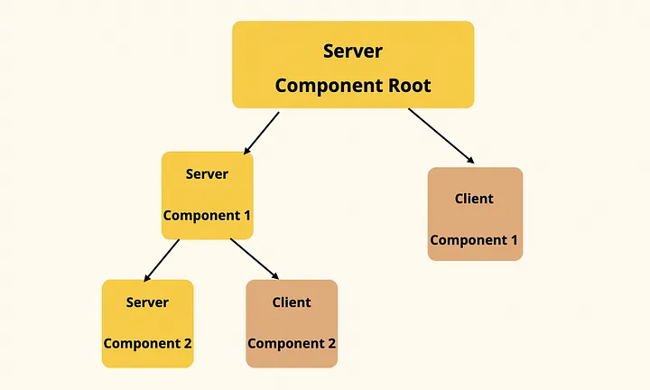

# 一、React Server Components基本概念

RSC是一种新型态的组件形式，可以专门在服务器上运行，并且可以执行数据可查询、文件读写等操作。与之相对应的就是React Client Components(RCC).

## 特性
1. 减少最终打包体积
2. 减少获取数据上的时间消耗
3. 渐进式渲染
https://github.com/facebook/react/blob/main/packages/react-client/src/ReactFlightClient.js

## 渲染方式

### 客户端渲染——Client Side Rendering

请求html => 加载js、css等资源 => 执行js并请求需要的数据 => 渲染出页面

组件存在于客户端，在与服务端交互后请求数据后再继续更新页面


```html
<!DOCTYPE html>
<html>
  <body>
    <div id="root"></div>
    <script src="/static/js/bundle.js"></script>
  </body>
</html>
```
### 静态渲染SSG——Static Site Generation

构建的时直接把结果页面输出为html到磁盘并在服务器启动静态server，实现静态站点生成。

不需要动态生成、页面交互少，如博客、新闻等站点。
### 服务端渲染SSR——Server Side Rendering

组件被分为两部分，服务端可渲染生成静态页面的初次渲染组件、后续需要交互和逻辑的客户端组件

1. 每次访问时在服务器端将页面预渲染成一个包含初始状态的 HTML 返回给客户端
2. 客户端会请求页面并加载包含应用逻辑的JS
3. 水合（hydrated）打包好的JS中的逻辑如交互逻辑、更新页面状态进入客户端渲染阶段。


## 
1. 它具有单一数据流的属性
2. 

   redux中只有一个单一的store，保存了整个应用的状态。单一的state tree由不同的reducer处理不同模块中的状态

2. 状态是只读的，只能通过reducer来改变

   redux在createStore后返回一个store，暴露了getstate，dispatch等方法，其状态不能直接被改变，只能通过dispatch发起通过reducer函数处理后返回新的状态

创建action操作  =>  dispatch调用action  =>  传递给reducer，reducer改变状态树  =>  更新视图

项目中如果要使用到redux，具体需要以下步骤

- createStore创建全局store，有三个参数，第一个是你创建的reducer，第二个是initState，最后是中间件，用来扩展功能
- 将创建的store全局下发给后代组件
- 组件接收到store，通过其getState方法获取状态以完成页面的数据渲染及UI的交互等...
- 在相互独立的应用模块中创建reducer以改变局部状态；创建actions表示不同的动作
- 在组件中通过dispatch调用action发送给reducer进行状态的改变
- 在顶部使用combineReducers将多个reducer合并为一并传递个createStore进行创建

## 1.1. State

redux中状态保存的地方，可通过store.getState()方法来获取当前状态

## 1.2. Action

创建不同动作，Action必须是包含type的一个对象，创建不同的动作

actionCreator创建动作函数，返回type和参数，通过dispatch(actions.setpermission(state))调用

## 1.3. dispatch

发送action，接收一个action对象

## 1.4. Reducer

是个纯函数，返回新的state；用来改变state树，接收两个参数，第一个为当前state树，第二个为action，通过不同的action改变state树中对应的不同state

## 1.5. 不要在 reducer 里做这些操作

- 修改传入参数；

  1.直接修改state返回，这样一来不符合reducer纯函数的设定，二来改变了state，但是地址没有改变，redux做新旧状态对比是对地址的比较，否则两个相同地址可能会出现问题

  ```javascript
  // hasChanged = hasChanged || nextStateForKey !== previousStateForKey
  ```

  因为redux为了做数据比较时保持较高的性能，只是对前后数据做了浅比较

  如果只改变了state中的某个状态，比如loading的true改成false可能页面不会有问题

  但是如果state有个arr属性，reducer中直接给arr push一个数据，在combinereducers中可能就无法比较新旧state的差异，导致页面无法渲然新的数据

  **给个例子**

- 执行有副作用的操作，如 API 请求和路由跳转；

  例如：进入reducer后，发起网络请求，如果请求失败了，就会报错；或者在请求过程中对数据进行更改，又发起了dispatch，会有问题

  这些异步操作可以放在中间件去执行

- 调用非纯函数，如 `Date.now()` 或 `Math.random()`。

  因为纯函数只会对内部的数据产生影响，不回影响到外部数据结构，输入和输出是同一个参数，如果调用了非纯函数就会对全局造成不可控的影响；

  因为reducer是个纯函数，在实际的开发应用中，开发者对于开发中遇到的副作用一般不会去考虑是否是reducer中出现的，这对代码调试及代码的可维护性带来影响；

  这会让代码逻辑变得十分混乱，所以reducer中如果没有这些操作，会大大减少开发中遇到的一些诡异问题

# 二.createStore.js： 基本的redux文件，生成全局状态机

```javascript
// 接收三个参数，reducer，state，
// enhancer(加强dispatch，对dispatch改造)，在dispatch中
export function createStore(reducer, preloadedState, enhancer) {
  // 条件判断，如果state是function且enhancer是function报错
  // 如果enhancer和第四个参数都是function报错,可以用多个enhancer但只需传入一个
  if (
    (typeof preloadedState === 'function' && typeof enhancer === 'function') ||
    (typeof enhancer === 'function' && typeof arguments[3] === 'function')
  ) {
    // compose them together to a single function
    throw new Error(
      'It looks like you are passing several store enhancers to ' +
        'createStore(). This is not supported. Instead, compose them ' +
        'together to a single function. See https://redux.js.org/tutorials/fundamentals/part-4-store#creating-a-store-with-enhancers for an example.'
    )
  }
// 如果第二个参数是function，没有第三个参数，默认将preloadedState设为undefined，将第二个参数变为第三个enhancer
  if (typeof preloadedState === 'function' && typeof enhancer === 'undefined') {
    enhancer = preloadedState
    preloadedState = undefined
  }
// 如果enhancer存在，对createstore包装
  if (typeof enhancer !== 'undefined') {
    // 如果不是function抛错
    if (typeof enhancer !== 'function') {
      throw new Error(
        `Expected the enhancer to be a function. Instead, received: '${kindOf(
          enhancer
        )}'`
      )
    }
// enhancer存在，将createstore作为参数传入，返回加强后的createstore，再传入reducer和preloadedState
    return enhancer(createStore)(reducer, preloadedState)
  }
// 对reducer类型判断
  if (typeof reducer !== 'function') {
    throw new Error(
      `Expected the root reducer to be a function. Instead, received: '${kindOf(
        reducer
      )}'`
    )
  }

  let currentReducer = reducer
  let currentState = preloadedState
  let currentListeners = []
  let nextListeners = currentListeners
  let isDispatching = false
// 方法见下
  function getState() 

  function subscribe(listener)

  function dispatch(action)

  function replaceReducer(nextReducer)

  function observable()
// 执行内部init action，将所有reducer返回初始状态，构建state tree
  dispatch({ type: ActionTypes.INIT })

  return {
    dispatch,
    subscribe,
    getState,
    replaceReducer,
    [$$observable]: observable,
  }
}
```


## 2.1. store下的几个常用方法

### 2.1.1. getState

```javascript
function getState() {
    if (isDispatching) {
      throw new Error(
        'You may not call store.getState() while the reducer is executing. ' +
          'The reducer has already received the state as an argument. ' +
          'Pass it down from the top reducer instead of reading it from the store.'
      )
    }
  // 正在dispatch过程中调用抛出异常
    return currentState
  // 返回当前的state树
  }
```


### 2.1.2. subscribe

用以注册listener，参数是一个函数，返回值是函数，调用返回的函数以取消监听

```javascript
function subscribe(listener) {
    if (typeof listener !== 'function') {
      throw new Error(
        `Expected the listener to be a function. Instead, received: '${kindOf(
          listener
        )}'`
      )
    }
// subscribe参数listener必须是个函数
    if (isDispatching) {
      throw new Error(
        'You may not call store.subscribe() while the reducer is executing. ' +
          'If you would like to be notified after the store has been updated, subscribe from a ' +
          'component and invoke store.getState() in the callback to access the latest state. ' +
          'See https://redux.js.org/api/store#subscribelistener for more details.'
      )
    }
// 如果正在dispatch进程中调用抛出异常
  
    let isSubscribed = true

    ensureCanMutateNextListeners()
  // 确保nextListeners不是currentListeners，以保证修改的是nextListeners，而不是currentListeners
    nextListeners.push(listener)

    return function unsubscribe() {
      if (!isSubscribed) {
        return
      }
// isSubscribed为false表示传入的监听函数已经被取消，直接return
      if (isDispatching) {
        throw new Error(
          'You may not unsubscribe from a store listener while the reducer is executing. ' +
            'See https://redux.js.org/api/store#subscribelistener for more details.'
        )
        // 如果正在dispatch进程中抛错
      }
      
      isSubscribed = false
			// isSubscribed变为false只有执行unsubscribe函数

      ensureCanMutateNextListeners()
      
      const index = nextListeners.indexOf(listener)
      nextListeners.splice(index, 1)
      // 取消当前监听，将其从列表中删除
      currentListeners = null
    }
  // 返回一个函数，用以取消刚添加的监听函数
  }

function ensureCanMutateNextListeners() {
  // 确保currentListeners和nextListeners不是指向同一个地址
    if (nextListeners === currentListeners) {
      nextListeners = currentListeners.slice()
    }
  }
```


### 2.1.3. dispatch

```javascript
function dispatch(action) {
    if (!isPlainObject(action)) {
      throw new Error(
        `Actions must be plain objects. Instead, the actual type was: '${kindOf(
          action
        )}'. You may need to add middleware to your store setup to handle dispatching other values, such as 'redux-thunk' to handle dispatching functions. See https://redux.js.org/tutorials/fundamentals/part-4-store#middleware and https://redux.js.org/tutorials/fundamentals/part-6-async-logic#using-the-redux-thunk-middleware for examples.`
      )
// action必须是个普通对象
    }
    if (typeof action.type === 'undefined') {
      throw new Error(
        'Actions may not have an undefined "type" property. You may have misspelled an action type string constant.'
      )
      // action必须有type属性，在reducer中对应其不同的type属性给予不同的状态更改
    }
  // 如果正在dispatch，抛出异常
    if (isDispatching) {
      throw new Error('Reducers may not dispatch actions.')
    }
    try {
      isDispatching = true
      // 将变量置为true，正在dispatch
      currentState = currentReducer(currentState, action)
      // 调用dispatch，执行到reducer，获取到当前state
    } finally {
      isDispatching = false
    }
  
    const listeners = (currentListeners = nextListeners)
    for (let i = 0; i < listeners.length; i++) {
      const listener = listeners[i]
      listener()
      // reducer执行完毕，通知给每个listener
    }
    return action
  // dispatch返回的是个action
  }
```

方法isPlainObject是用来判断传入的action是否是个普通object

```javascript
export default function isPlainObject(obj) {
  if (typeof obj !== 'object' || obj === null) return false
// 如果不是对象返回false，抛错
  let proto = obj
  while (Object.getPrototypeOf(proto) !== null) {// obj向上寻找原型链
    proto = Object.getPrototypeOf(proto)
    // 最终 proto 会指向 Object.prototype   null
  }

  return Object.getPrototypeOf(obj) === proto
}
```

### 2.1.4. replaceReducer

```javascript
function replaceReducer(nextReducer) {
    if (typeof nextReducer !== 'function') {
      throw new Error(
        `Expected the nextReducer to be a function. Instead, received: '${kindOf(
          nextReducer
        )}`
      )
    }
 	// 如果传入的reducer不是函数抛出异常

    currentReducer = nextReducer
	// 将传入的reducer赋值给当前reduer
    dispatch({ type: ActionTypes.REPLACE })
  // 调用内置action，用以更新reducer
  }
```

# 三、combineReducers.js：将多个reducer合并并暴露给createStore作为参数

因为redux规定整个项目只能拥有一个store，而实际业务中需要按照不同的场景创建多个相对应的reducer，所以需要此方法将多个reducer合并后传递给createStore统一调用

## 1.1. combineReducers

```javascript
function combineReducers(reducers) {
  const reducerKeys = Object.keys(reducers)
  // 不同reducer给定不同的key值，以确保reducer唯一性
  const finalReducers = {}
  for (let i = 0; i < reducerKeys.length; i++) {
    // 对传入的reducer做遍历
    const key = reducerKeys[i]

    if (process.env.NODE_ENV !== 'production') {
      if (typeof reducers[key] === 'undefined') {
        warning(`No reducer provided for key "${key}"`)
      }
      // reducer需要有个key
    }

    if (typeof reducers[key] === 'function') {
      finalReducers[key] = reducers[key]
    }
    // reducer是个函数
  }
  const finalReducerKeys = Object.keys(finalReducers)
  // 将循环完符合要求的的reducer暂存

  let unexpectedKeyCache
  if (process.env.NODE_ENV !== 'production') {
    unexpectedKeyCache = {}
  }

  let shapeAssertionError
  try {
    assertReducerShape(finalReducers)
  } catch (e) {
    shapeAssertionError = e
  }
  // 将初步符合要求的reducer传入函数assertReducerShape再次判断是否符合要求

  return function combination(state = {}, action) {
    if (shapeAssertionError) {
      throw shapeAssertionError
    }
    // 如果reducer中有不符合要求的，抛出异常

    if (process.env.NODE_ENV !== 'production') {
      const warningMessage = getUnexpectedStateShapeWarningMessage(
        state,
        finalReducers,
        action,
        unexpectedKeyCache
      )
      if (warningMessage) {
        warning(warningMessage)
      }
    }
		// 定义变量表示state tree是否改变
    let hasChanged = false
    // 存放最新的状态
    const nextState = {}
    // 遍历符合要求的reducers
    for (let i = 0; i < finalReducerKeys.length; i++) {
      const key = finalReducerKeys[i] // 不同reducer的key
      const reducer = finalReducers[key] // 不同reducer
      const previousStateForKey = state[key] // 当前状态
      const nextStateForKey = reducer(previousStateForKey, action) // 返回新的状态
      if (typeof nextStateForKey === 'undefined') {
        const actionType = action && action.type
        throw new Error(
          `When called with an action of type ${
            actionType ? `"${String(actionType)}"` : '(unknown type)'
          }, the slice reducer for key "${key}" returned undefined. ` +
            `To ignore an action, you must explicitly return the previous state. ` +
            `If you want this reducer to hold no value, you can return null instead of undefined.`
        )
        // 新的状态树为undefined抛错。initState必须定义
      }
      nextState[key] = nextStateForKey
      // 将最新的状态暂存
      hasChanged = hasChanged || nextStateForKey !== previousStateForKey
      // 判断状态是否改变
    }
    hasChanged =
      hasChanged || finalReducerKeys.length !== Object.keys(state).length
    return hasChanged ? nextState : state
    // 如果改变则返回最新状态，否则返回当前状态
  }
  // 返回一个合并后的reducer
}
```

## 1.2. assertReducerShape

对reducer的返回值进行校验不可为undefined

```javascript
function assertReducerShape(reducers) {
  // 遍历reducers
  Object.keys(reducers).forEach((key) => {
    const reducer = reducers[key]
    const initialState = reducer(undefined, { type: ActionTypes.INIT })

    if (typeof initialState === 'undefined') {
      throw new Error(
        `The slice reducer for key "${key}" returned undefined during initialization. ` +
          `If the state passed to the reducer is undefined, you must ` +
          `explicitly return the initial state. The initial state may ` +
          `not be undefined. If you don't want to set a value for this reducer, ` +
          `you can use null instead of undefined.`
      )
      // 如果reducer初始值undefined会抛出异常，可以用null代替
    }

    if (
      typeof reducer(undefined, {
        type: ActionTypes.PROBE_UNKNOWN_ACTION(),
      }) === 'undefined'
    ) {
      throw new Error(
        `The slice reducer for key "${key}" returned undefined when probed with a random type. ` +
          `Don't try to handle '${ActionTypes.INIT}' or other actions in "redux/*" ` +
          `namespace. They are considered private. Instead, you must return the ` +
          `current state for any unknown actions, unless it is undefined, ` +
          `in which case you must return the initial state, regardless of the ` +
          `action type. The initial state may not be undefined, but can be null.`
      )
      // 无论任何action，都需要返回state而不应该是undefined
    }
  })

```


## 1.3. getUnexpectedStateShapeWarningMessage

生产环境中执行

```javascript
function getUnexpectedStateShapeWarningMessage(
  inputState,
  reducers,
  action,
  unexpectedKeyCache
) {
    // 获取reducer的key
  const reducerKeys = Object.keys(reducers)
  // 对state来源判断
  const argumentName =
    action && action.type === ActionTypes.INIT
      ? 'preloadedState argument passed to createStore'
      : 'previous state received by the reducer'

  if (reducerKeys.length === 0) {
    return (
      'Store does not have a valid reducer. Make sure the argument passed ' +
      'to combineReducers is an object whose values are reducers.'
    )
    // 没有reducer传入抛出异常
  }

  if (!isPlainObject(inputState)) {
    return (
      `The ${argumentName} has unexpected type of "${kindOf(
        inputState
      )}". Expected argument to be an object with the following ` +
      `keys: "${reducerKeys.join('", "')}"`
    )
    // state不是objact抛出异常
  }
    
  const unexpectedKeys = Object.keys(inputState).filter(
    (key) => !reducers.hasOwnProperty(key) && !unexpectedKeyCache[key]
  )

  unexpectedKeys.forEach((key) => {
    unexpectedKeyCache[key] = true
  })
// 如果是replaceReducer调用直接返回
  if (action && action.type === ActionTypes.REPLACE) return

  if (unexpectedKeys.length > 0) {
    return (
      `Unexpected ${unexpectedKeys.length > 1 ? 'keys' : 'key'} ` +
      `"${unexpectedKeys.join('", "')}" found in ${argumentName}. ` +
      `Expected to find one of the known reducer keys instead: ` +
      `"${reducerKeys.join('", "')}". Unexpected keys will be ignored.`
    )
  }
}
```

# 四、bindActionCreators

不用调用dispatch将action发给reducer，可以直接调用bindActionCreators

//  bindActionCreators(ActionCreators.updateLinksState,dispatch)({loading:true})

```javascript
function bindActionCreator(actionCreator, dispatch) {
  return function () {
    return dispatch(actionCreator.apply(this, arguments))
  }
}


function bindActionCreators(actionCreators, dispatch) {
  // 如果actionCreators是个函数直接dispatch发送action
  if (typeof actionCreators === 'function') {
    return bindActionCreator(actionCreators, dispatch)
  }
	// actionCreators必须为object类型
  if (typeof actionCreators !== 'object' || actionCreators === null) {
    throw new Error(
      `bindActionCreators expected an object or a function, but instead received: '${kindOf(
        actionCreators
      )}'. ` +
        `Did you write "import ActionCreators from" instead of "import * as ActionCreators from"?`
    )
    
  }

  const boundActionCreators = {}
  for (const key in actionCreators) {
    const actionCreator = actionCreators[key]
    if (typeof actionCreator === 'function') {
      // 给actionCreators绑定dispatch
      boundActionCreators[key] = bindActionCreator(actionCreator, dispatch)
    }
  }
  return boundActionCreators
}
```

# 五、applyMiddleware

```javascript
// 将多个中间件合并，对于已有中间件可直接传入，传入前需查看文档，有的中间件对传入次序有要求
function applyMiddleware(...middlewares) {
  // 返回一个函数
  return (createStore) => (...args) => {
    // 获取store
    const store = createStore(...args)
    let dispatch = () => {
      throw new Error(
        'Dispatching while constructing your middleware is not allowed. ' +
          'Other middleware would not be applied to this dispatch.'
      )
    }
// middleware可以获取getstate和dispatch两个api
    const middlewareAPI = {
      getState: store.getState,
      dispatch: (...args) => dispatch(...args),
    }
    const chain = middlewares.map((middleware) => middleware(middlewareAPI))
    // 使用compose函数将所有middlewares执行，前一个的返回值作为后一个的入参，最后执行store.dispatch返回
    dispatch = compose(...chain)(store.dispatch)
// 函数返回store和替换的dispatch
    return {
      ...store,
      dispatch,
    }
  }
}
```

# 六、compose

辅助函数，将多个函数组合成一个新的函数，并按照入参顺序依次执行，返回一个新函数

```javascript
function compose(...funcs) {
  // 如果没有传入，返回一个基本参数
  if (funcs.length === 0) {
    return (arg) => arg
  }
  // 如果只有一个函数，直接返回传入的函数
  if (funcs.length === 1) {
    return funcs[0]
  }
// 前一个函数的执行结果作为下一个函数的入参，返回这个合并后的函数
  return funcs.reduce((a, b) => (...args) => a(b(...args)))
}
```

